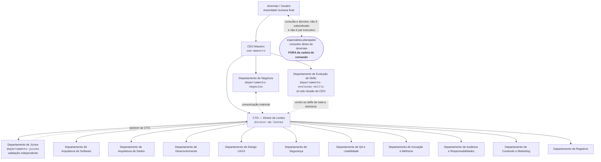

# Estrutura Final de Skills — Organograma

> **Status:** migração em andamento. Governança, CEO Maestro, Diretor de Lentes, Negócios,
> Evolução de Skills, Juízes, Auditoria, Arquitetura de Software, Arquitetura de Dados,
> Desenvolvimento, Design UX/UI, QA e Usabilidade, Segurança, Conteúdo e Marketing, Registros e
> **Inovação e Melhoria** estão materializados — os **dez** Departamentos operacionais desta página
> têm pasta, contrato, schema e validador próprios, e o Departamento de Juízes, em camada paralela,
> também. Cadeia canônica medida em 2026-07-29, após a adoção do ADR-014 em toda a cadeia de
> julgamento: **1697/1697 PASS** (motor compartilhado 66 + os 15 validadores de pacote). O que falta em quase
> todos é **prova comportamental em runtime**, não estrutura. As fontes legadas permanecem intactas
> para rollback.
>
> *Reconciliação da medição: o plano desta frente herdou 1532 de outro checkout, mas o HEAD
> comparável já media 1575 verificações. O delta reproduzível é 1575 → 1697, inteiramente explicado
> pela cobertura nova em CEO (+22), Negócios (+56), Diretor (+26) e Juízes (+18).*

## Estado da migração

- [x] `regras-de-ouro/` — fonte normativa única da nova estrutura.
- [x] `ceo-maestro/` — contrato executivo, handoffs, dois níveis do ADR-014 e exceção de Jeremias.
  Mecânica: **55/55 PASS**.
- [x] `ceo-maestro/departamento-negocios/` — gerente, três agentes, matriz com o Diretor e
  validação. Mecânica: **226/226 PASS**; forward: 15/15 casos e 62/62 assertions PASS.
- [x] `especialista-planejador/` — **fora da cadeia de comando**, no topo da Estrutura, instalado em
  2026-08-08. Consultor direto de Jeremias: sem superior, sem subordinado, sem `EXECUTIVE_MISSION`.
  Mecânica própria: **14/14 PASS**. Ver a seção *Fora da cadeia de comando* mais abaixo — ele não
  entra na contagem de Departamentos operacionais nem na de pares executivos do CEO.
- [x] `ceo-maestro/diretor-de-lentes/` — núcleo diretor, contratos, handoffs, schema e
  validação; os Departamentos operacionais continuam em migração separada. Mecânica:
  **79/79 PASS**.
- [x] `ceo-maestro/diretor-de-lentes/departamento-juizes/` — gerente, três agentes, protocolo,
  rubrica, schema e validação. Origem: `lente-juizes`. Mecânica executada: **88/88 PASS**.
  **Forward comportamental executado em 2026-07-26** — 15/16 casos, 60/60 assertions, zero
  contorno, acionamento 13/16 unânime em roteamento cego (18 instâncias independentes). Pendências
  abertas: caso 1 do `evals.json` mal especificado e colisão de description com o Diretor. Baseline
  do legado e auditoria independente continuam **pendentes** — ver
  `ceo-maestro/diretor-de-lentes/departamento-juizes/evals/FORWARD-TEST.md`.
- [x] `…/departamentos-operacionais/departamento-auditoria-responsabilidades/` — gerente, três
  agentes, protocolo, matriz das dez dimensões, schema e validação. Origem:
  `lente-auditor-responsabilidades`. **Forward executado em 2026-07-26** — 15 casos válidos, 58/60
  asserções, zero contorno, 13 casos com nota cheia. O caso 1 do catálogo é inválido por
  especificação. Baseline do legado e auditoria independente **pendentes** — ver
  `…/departamento-auditoria-responsabilidades/evals/FORWARD-TEST.md`.
- [x] `ceo-maestro/departamento-evolucao-skills/` — **skill nova**, não migração: gerente, quatro
  agentes, método com fronteira de Pareto, mineração com proveniência e validação. Mecânica
  executada: 57/57 PASS. **Forward executado em 2026-07-26** — 15 casos válidos, 57/60 asserções,
  zero contorno. Achou um **vão real no contrato**: o `deliverable_type` do `executiveSubmission`
  do CEO não admitia `analysis`, então o modo `AVALIACAO` entregava num beco. Corrigido de forma
  aditiva. Ver `evals/FORWARD-TEST.md`.
- [x] `…/departamentos-operacionais/departamento-conteudo-marketing/` — gerente, oito agentes,
  protocolo, schema, ADR-007, pesquisa oficial e validação. Consolidação híbrida de
  `redator-tecnologia-ia` + `email-marketing-html`, com capacidades novas de estratégia, imagem,
  vídeo, publicidade, relatoria e conformidade. Núcleo integrado: 299/299 PASS; regressões
  adicionais: Negócios 169/169 e Evolução 56/56. Auditoria de materialização:
  **APROVADO_COM_RESSALVAS** — ver `…/departamento-conteudo-marketing/evals/PLACAR.md`.
- [x] `…/departamentos-operacionais/departamento-arquitetura-software/` — gerente, **seis** agentes,
  protocolo, fronteiras, oito dimensões como cobertura, schema e validação. Origem:
  `lente-arquiteto-software`. Mecânica: **72/72 PASS**. **Forward executado em 2026-07-26** — 16
  instâncias, 16/16 casos, 60/65 asserções, zero contorno. Três instâncias acharam o mesmo defeito
  real: os gabaritos das Regras D e S produziam artefato que o schema recusa. Corrigido e travado
  por guarda nova no validador. Baseline do legado e gate dos Juízes **pendentes** — ver
  `…/departamento-arquitetura-software/evals/FORWARD-TEST.md`.
- [x] `…/departamentos-operacionais/departamento-registros/` — gerente, **quatro** agentes,
  protocolo, naturezas e roteamento, schema, ADR-005 e validação. Origem: `orquestrador-registros`.
  **Mecânica executada:** 169/169 PASS do Departamento (82 positivos · 87 negativos) e **429/429 PASS
  da cadeia completa** — `_compartilhado` 55, Registros 169, Auditoria 64, Juízes 61, Diretor 48,
  CEO 32. *(O validador do Diretor passou a 49 quando `departamento-conteudo-marketing` entrou e lhe
  acrescentou um caso próprio; a cadeia relida depois soma 430. A diferença é daquela frente, não
  desta: os 169 do Departamento e os demais pacotes não mudaram.)* Legado reconferido no passo 10 e
  **intacto**: 154 arquivos, 154 hashes idênticos. Continuam **pendentes** o forward comportamental
  (16 prompts, nenhum executado), o baseline do pacote legado e o acionamento por `description` em
  runtime, além do parecer dos Juízes — ver `…/departamento-registros/evals/PLACAR.md`.
- [x] `…/departamentos-operacionais/departamento-arquitetura-dados/` — **skill nova**, não migração:
  gerente, **seis** agentes, protocolo, fronteiras recíprocas ao ADR-006, gates de entrada e saída
  mecânicos e validação. Fundamentada na canônica `arquiteto-dados`, nas RO por track e nas lições
  de produção registradas em `Aprendizagem/`. Mecânica do Departamento na data desta cascata:
  110/110 PASS — **hoje 114/114** (o pacote cresceu depois); cadeia integrada declarada então como
  **873/873 PASS**, número que **não é reproduzível**: ele foi medido antes de QA e Design entrarem
  e nenhum placar da árvore o registra, então não se sabe quais validadores ele somava. Fica aqui
  como registro histórico, não como alegação — a cadeia verificável hoje é **1531/1531**. Fecha a
  fronteira que a
  Arquitetura de Software abriu — o `delegationTarget` dela agora tem destinatário real. **Forward
  comportamental executado em 2026-07-26** — 16 instâncias independentes, 16/16 casos, 49/49
  asserções, zero contorno; achou dois defeitos, um deles no próprio schema (a lição L5 existia só
  em prosa) já corrigido e travado. Baseline não se aplica (skill nova); auditoria e parecer dos
  Juízes **pendentes** — ver `…/departamento-arquitetura-dados/evals/FORWARD-TEST.md`.
- [x] `…/departamentos-operacionais/departamento-design-ux-ui/` — gerente, **sete** agentes,
  protocolo com dois modos, nove dimensões como cobertura, gate visual mecânico, taxonomia de
  evidência travada por schema e validação. Origem: `lente-designer` (249 arquivos, **intactos**).
  Mecânica do Departamento: 108/108 PASS; cadeia integrada: **1097/1097 PASS** (inclui os 116 do
  `departamento-qa-usabilidade`, materializado por outra frente). **Forward comportamental executado
  em 2026-07-26** — 18 instâncias independentes, 15/16 casos, 45/45 asserções, zero contorno,
  acionamento 16/16 idêntico entre dois roteadores cegos. A separação de conflito de interesse do
  ADR-009 §6 **pegou cinco falhas reais de contraste** do agente de linguagem visual em duas
  instâncias. Auditoria e parecer dos Juízes **pendentes**; o baseline do legado existe mas **não é
  comparável** pelos instrumentos atuais — ver `…/departamento-design-ux-ui/evals/FORWARD-TEST.md`.
- [x] `…/departamentos-operacionais/departamento-qa-usabilidade/` — gerente, **três** agentes e
  sete perfis de superfície, com propriedade exclusiva entre correção funcional, atributos não
  funcionais e experiência/acessibilidade. Origem: `lente-qa-usabilidade`; legado **intacto** em
  87/87 arquivos. Mecânica do Departamento: 116/116 PASS; cadeia integrada: **377/377 PASS**;
  forward 29/29 e reauditorias adversariais 9/9 + 10/10. O Departamento executa e consolida
  evidência, mas não pontua nem julga — ver `…/departamento-qa-usabilidade/evals/PLACAR.md`.
- [x] `…/departamentos-operacionais/departamento-seguranca/` — gerente, **oito** agentes, protocolo,
  cobertura e admissibilidade, schema, ADR-010 e validação. Origem: `lente-especialista-seguranca`.
  **Mecânica executada:** **183/183 PASS** do Departamento (84 positivos · 99 negativos) e
  **1407/1407 PASS da cadeia completa** na entrega da fase de evals; **184/184** e **1408/1408** após
  esta cascata, que fechou no schema o conflito de interesse do segredo (ADR-010, decisão 5) e
  acrescentou o caso negativo correspondente — mudança de contrato declarada, não regressão. Cadeia
  medida agora: `_compartilhado` 61, Segurança **184**, Desenvolvimento 105, Registros 170, QA 117,
  Arquitetura de Dados 114, Design 109, Arquitetura de Software 72, Auditoria 65, Conteúdo e
  Marketing 39, Negócios 170, Evolução 57, Juízes 62, Diretor 50, CEO 33 — e, somando o
  `departamento-inovacao-melhoria` (59), que entrou por frente paralela durante esta cascata,
  **1467/1467**. Legado
  reconferido no passo 10 e **intacto**: 154 arquivos, 154 hashes idênticos, digest de manifesto
  `d92607a3fa32f80c…`. Continuam **pendentes** o forward comportamental (15 prompts, nenhum
  executado), o baseline do pacote legado e o acionamento por `description` em runtime, além do
  parecer dos Juízes — ver `…/departamento-seguranca/evals/PLACAR.md`.
- [x] `…/departamentos-operacionais/departamento-inovacao-melhoria/` — gerente, três agentes,
  `references/` (ADR-013, `protocolo-inovacao-melhoria.md`, fronteiras e origem), schema e `evals/`
  completos. Origem: `orquestrador-inovacao-melhoria`. **Cascata do passo 10 executada em
  2026-07-26**, na rodada 3 daquela frente. **Mecânica executada:** **122/122 PASS** do Departamento
  e **1531/1531 PASS da cadeia completa** — o salto desde 1467 é `122 − 59 = +63` verificações
  **deste pacote**, cobertura nova e não regressão de vizinho; nenhum outro validador mudou de
  número. Corpus adversarial independente: **45/45 mutações rejeitadas, 0 escapes** (P1=0, P2=0);
  `skill-creator`: **4/4**. Legado reconferido no passo 10 e **intacto**: 22 arquivos, 22 hashes
  idênticos, 101.022 bytes.
  **A rodada 2 é a lição desta linha:** o validador imprimia **59/59 PASS** enquanto **39 de 45
  mutações escapavam** — o verde media forma, não semântica, e nenhuma das ausências normativas que
  a auditoria de governança via a olho era detectada mecanicamente. As três classes fechadas foram
  contexto confiável na cadeia, gate derivado da evidência real e estrutura normativa conferida pelo
  próprio validador. Continuam **pendentes** o **acionamento espontâneo em runtime** (`SKIP`
  declarado: as três instâncias do forward receberam o pacote por carga explícita de caminho, logo
  aderência foi medida e acionamento não) e o parecer dos Juízes — ver
  `…/departamento-inovacao-melhoria/evals/PLACAR.md`, seção “O que ainda não foi provado”.
  *(O `departamento-desenvolvimento` também foi materializado em 2026-07-26 por frente paralela — a
  linha anterior dizia "três Departamentos restantes" porque nunca foi atualizada por ela; a seção 3
  abaixo já o descreve.)*

## Princípios da nova estrutura

1. O **CEO Maestro** governa a operação, define a rota e integra os resultados; não executa.
2. O **Diretor de Lentes (CTO)** dirige os departamentos operacionais, recebe os vereditos
   do Departamento de Juízes e decide o próximo encaminhamento; não executa.
3. Cada **Departamento** é uma skill gerente-orquestradora; decide, delega e consolida, mas não
   produz o artefato final.
4. Cada departamento começa com **no mínimo três agentes executores**. Não há teto artificial:
   a quantidade é determinada por cobertura exclusiva, registrada em ADR e testada.
5. O **Departamento de Negócios** responde diretamente ao CEO Maestro e mantém comunicação
   matricial com o Diretor de Lentes. Ele não fica subordinado ao Diretor.
5b. O **Departamento de Evolução de Skills** também responde diretamente ao CEO Maestro, como
   terceiro par executivo. Ele evolui as skills de **toda** a estrutura — inclusive as do Diretor e
   dos Departamentos abaixo dele —, e por isso não pode ficar sob o Diretor. **Só opera sob missão
   do CEO**: não tem rotina nem iniciativa própria. Produz e prova candidatos; não promove, não
   pontua e não escolhe vencedor.
5c. O **Departamento de Conteúdo e Marketing** responde ao Diretor. Recebe contexto comercial de
   Negócios pela matriz autorizada do CTO, devolve candidato ao CTO para julgamento e separa
   relatório de desempenho de custódia institucional, que pertence a Registros.
6. O **Departamento de Juízes** responde ao Diretor de Lentes e ocupa uma camada paralela aos
   departamentos operacionais. Recebe `JUDGMENT_REQUEST` somente do Diretor e devolve o parecer
   somente a ele; não há canal lateral direto com produtores.
7. O Departamento de Juízes não executa nem corrige entregas. Quando reprovar, devolve ao Diretor
   os motivos e ajustes; o Diretor emite o retrabalho ao Departamento responsável.
8. Toda skill — CEO, Diretor, Departamento ou Agente — deve possuir um
   `CONTRATO-DE-COMPROMISSO.md`.
9. Todos os contratos devem apontar para uma única fonte normativa:
   `regras-de-ouro/REGRAS-DE-OURO.md`. As regras não serão copiadas para cada skill.
10. O usuário/Jeremias permanece como autoridade humana final sobre intenção, escopo,
   prioridade e autorização.

## Organograma executivo



O `especialista-planejador` aparece **solto**, ligado só a Jeremias e por traço pontilhado de mão
dupla, porque é exatamente isso que ele é: um consultor que Jeremias consulta e que devolve a
Jeremias. Ele **não** tem seta para o CEO, para o CTO nem para Departamento nenhum — não emite nem
recebe `EXECUTIVE_MISSION`, não fala com departamentos e não é um quarto par executivo. O fluxo
inteiro é `Jeremias → especialista → Jeremias → ceo-maestro`, e o último passo é decisão de
Jeremias, não repasse do especialista.

O traço contínuo representa subordinação. O traço pontilhado representa comunicação executiva.
Nos fluxos de Conteúdo e Marketing, o Departamento solicita contexto ao CTO, o CTO usa a matriz
autorizada com Negócios e devolve a referência assinada. Para julgamento, o candidato volta ao
CTO, que emite o pedido aos Juízes e recebe o parecer. O diagrama não cria contato direto entre
produtores, Negócios ou Juízes.

## Departamentos e agentes mínimos

> **Como contar.** A numeração abaixo é só a ordem de leitura desta lista e **não** diz quem é
> operacional. São **dez** Departamentos operacionais — os que vivem em
> `diretor-de-lentes/departamentos-operacionais/` e recebem `DEPARTMENT_MISSION` do CTO: itens
> 1–9 e 11 (Registros). Os itens **10 (Juízes)**, **12 (Evolução de Skills)** e **13 (Negócios)**
> estão fora dessa linha e vêm marcados como tal. Contar as 13 seções como "operacionais" foi a
> origem do "onze Departamentos operacionais" que circulou neste arquivo até 2026-07-26.

### 1. Departamento de Arquitetura de Software

- Pasta/skill gerente: `departamento-arquitetura-software`
- `agente-drivers-e-restricoes`
- `agente-modularidade-e-limites`
- `agente-integracoes-e-contratos`
- `agente-qualidade-e-operacao`
- `agente-alternativas-e-tradeoffs`
- `agente-adr-e-c4`

**Migrado em 2026-07-26 — seis agentes, não três.** Os nomes anteriores (`agente-c4-e-contexto`,
`agente-adr-e-tradeoffs`, `agente-modularidade-e-integracoes`) foram propostos antes da leitura da
fonte legada e fundiam pares que ela separa por boa razão: **modularidade** (fronteiras internas) e
**integração** (contratos entre partes) são perguntas diferentes; e **alternativas** (gerar opções)
com **ADR** (registrar a decisão) na mesma mão faz o autor documentar a própria escolha. Os seis
derivam do modelo de papéis do legado, menos o sétimo — "juiz independente" —, que saiu porque
julgar é do `departamento-juizes`.

O Departamento **produz e não julga**: a rubrica ponderada, o corte 9,5 e o aparato de
autojulgamento do legado não migraram; as oito dimensões viraram **cobertura**. E a fronteira com as
lentes vizinhas é mecânica: **quem é dono do dado e como as partes o trocam é arquitetura; o modelo
e a evolução do dado é do `departamento-arquitetura-dados`; a implementação é do
`departamento-desenvolvimento`** — o schema não tem campo para entidade, índice, migração ou código,
e o validador falha se algum aparecer. Decisões em
`…/departamento-arquitetura-software/references/adr-006-arquitetura-sem-julgamento-e-com-seis-agentes.md`.

### 2. Departamento de Arquitetura de Dados

- Pasta/skill gerente: `departamento-arquitetura-dados`
- `agente-perguntas-e-volumetria`
- `agente-escolha-de-persistencia`
- `agente-modelo-e-grao`
- `agente-evolucao-e-migracao`
- `agente-escala-e-acesso`
- `agente-contratos-e-integridade`

Materializado em 2026-07-26 como **skill nova** — não havia lente legada, e a fundamentação vem da
canônica `arquiteto-dados`, das Regras de Ouro e das lições registradas em `Aprendizagem/`. Seis
agentes, um por área do domínio, com **duas separações por conflito de interesse**: quem escolhe o
motor não modela o grão, e quem modela o grão não desenha a migração.

Dois gates são mecânicos, não conselho. **Entrada:** três perguntas do negócio e volumetria em ordem
de grandeza, ou a frente não abre. **Saída (RI-04):** grão declarado · plano expand/contract com
rollback · índice ou partição justificado por acesso real — **sem compensação entre os itens**, e o
schema recusa `ENTREGUE` sem os três. A fronteira é o recíproco exato do ADR-006, e a
`architectural_constraint` recebida da Arquitetura é **vinculante**: conflito escala ao Diretor, não
se contorna. Decisões em
`…/departamento-arquitetura-dados/references/adr-008-dados-skill-nova-e-seis-agentes.md`.

### 3. Departamento de Desenvolvimento

- Pasta/skill gerente: `departamento-desenvolvimento`
- `agente-java-e-spring`
- `agente-javafx-desktop`
- `agente-web-frontend`
- `agente-tauri-desktop`
- `agente-mobile-flutter`
- `agente-persistencia-e-sql`
- `agente-revisao-e-refatoracao`
- `agente-testes-e-depuracao`

Migrado em 2026-07-26 da `lente-dev-senior`. **Oito** agentes: cinco por track do acervo — Java e
Spring, JavaFX, web, Tauri, Flutter — mais persistência e SQL, revisão e testes, que atravessam
todos. A forma do time segue a forma do acervo: **31 das 57 skills do catálogo são geradores de
desenvolvimento**, e a regra canônica vale — *quando existe gerador para a tarefa, ele conduz e o
agente revisa*.

**É o único Departamento que executa.** Todos os outros travam `test_summary` em `0/0/0` por
`const`; aqui o número é real, porque os agentes compilam e rodam a bateria. O validador tem um caso
que **falha se alguém travar `pass` em zero**.

Duas separações por conflito de interesse: quem implementa não revisa a própria saída, e não declara
`PASS` na própria bateria. Gate de saída: piso de bordas (vazio, limite, erro) e evidência fresca
contra o candidato entregue. Os cinco inegociáveis — validação em fronteira de confiança, erro que
evita perda de dado, segurança, acessibilidade, requisito explícito — **não são degrau da escada**, e
o schema recusa marcá-los como simplificados. Decisões em
`…/departamento-desenvolvimento/references/adr-012-desenvolvimento-executa-com-oito-agentes.md`.


### 4. Departamento de Design UX/UI

- Pasta/skill gerente: `departamento-design-ux-ui`
- `agente-direcao-e-anti-slop`
- `agente-fluxo-estados-e-transicoes`
- `agente-acessibilidade-medida`
- `agente-linguagem-visual`
- `agente-nitidez-e-adaptacao`
- `agente-dataviz`
- `agente-design-system-e-tokens`

Migrado em 2026-07-26 da `lente-designer` — o **pacote legado mais maduro** do Comitê (249 arquivos,
protocolo de 527 linhas, dois JSON Schemas, baseline já executado). **Sete** agentes, um por
dimensão com dono exclusivo; as dimensões 8 (Polish Pass) e 9 (evidência) ficam com a gerente.

Três decisões mudaram forma em relação ao legado. O **painel cego não migrou**: julgamento
comparativo é o modo `DISPUTA` do `departamento-juizes` (ADR-002), e duplicá-lo criaria dois donos
da mesma autoridade. A **descoberta de executores em runtime não migrou**: o time é declarado e
travado por `enum`, e o que ela dava de flexibilidade volta como `delegated_dependency`. E as **nove
dimensões da rubrica viraram cobertura**, não nota.

Duas travas nasceram mecânicas: o **`DESIGN_GATE`** — com ele em `PENDING`, nenhuma dependência de
implementação sai, e aprovação exige ator nomeado, momento e superfície revisável — e a **taxonomia
de evidência**: critério `ATENDIDO` sustentado por `REPORTED` ou `UNAVAILABLE` é rejeitado pelo
schema. Decisões em
`…/departamento-design-ux-ui/references/adr-009-design-sem-painel-cego-e-com-time-fixo.md`.

### 5. Departamento de Segurança

- Pasta/skill gerente: `departamento-seguranca`
- `agente-modelagem-de-ameacas`
- `agente-identidade-e-acesso`
- `agente-seguranca-de-aplicacao`
- `agente-configuracao-e-hardening`
- `agente-cadeia-de-suprimentos`
- `agente-privacidade-e-dados-pessoais`
- `agente-deteccao-e-resposta`
- `agente-prova-e-reteste`

**Migrado em 2026-07-26 — oito agentes, não três.** Os três nomes anteriores foram propostos antes da
leitura da fonte legada, e um deles, `agente-privacidade-e-compliance`, **nunca existiu como pasta**:
virou `agente-privacidade-e-dados-pessoais`, porque "compliance" alcança a conformidade com as Regras
de Ouro — que é do `departamento-auditoria-responsabilidades` — e sugere parecer jurídico, que o
próprio legado exclui. O time nasce **por função verificável**: as oito funções do `ROLE_REGISTRY 1.1`
da `lente-especialista-seguranca`, cada uma com `Responsabilidade`, `Entrega mínima` e `Não assume`
já escritos lá em prosa. Com apenas três, `agente-seguranca-de-aplicacao` teria de reivindicar sete
das doze dimensões, e `EVIDENCE`, `SUPPLY_CHAIN`, `CLOUD_CONFIG` e `DETECTION_RESPONSE` ficariam
órfãs.

O Departamento **não julga**: modo `JULGAR`, escala 0–10, pesos, corte 9,5, piso de dimensão crítica,
vetos e `REPORT_VERDICT` ficaram no legado — a nota é do `departamento-juizes` (ADR-002) e a
conformidade é do `departamento-auditoria-responsabilidades` (ADR-003). As doze dimensões viraram
**cobertura**, não nota: **dez áreas com agente dona única**, `ai_llm` **transversal e consolidada
pela gerente** (dimensão 10, que não gera agente porque disputaria recorte com cada irmão) e a
dimensão 12 — rastreabilidade, cobertura, risco e tratamento — também da gerente, por ser
consolidação. O que permanece é a **recomendação de risco do alvo** — `LIBERAR |
LIBERAR_COM_RESSALVAS | BLOQUEAR | INDETERMINADO` —, que não é nota e não é gate geral, com os cinco
gatilhos de `BLOQUEAR` convertidos de prosa em **condição de schema**.

Duas separações por **conflito de interesse** são mecânicas: **quem produz o achado não certifica a
prova de fechamento** (`agente-prova-e-reteste` prova, não descobre) e **quem descobre o segredo
exposto não declara o incidente contido** — a descoberta é do `agente-seguranca-de-aplicacao`, o ciclo
revogação → rotação → contenção → `close_when` é do `agente-deteccao-e-resposta`, e o schema **rejeita**
o achado de segredo válido em que os dois papéis caem no mesmo agente. Atividade ativa (DAST, fuzz,
pentest) é **fail-closed** sob autorização estruturada, e o que não puder ser executado vira `SKIP`
declarado, nunca `PASS`. Decisões em
`…/departamento-seguranca/references/adr-010-seguranca-sem-julgamento-e-time-por-funcao.md`.

### 6. Departamento de QA e Usabilidade

- Pasta/skill gerente: `departamento-qa-usabilidade`
- `agente-testes-funcionais`
- `agente-testes-nao-funcionais`
- `agente-usabilidade-e-acessibilidade`

Migrado em 2026-07-26 da `lente-qa-usabilidade`, com o legado preservado em
87/87 arquivos. Os três agentes são folhas executoras e atendem, por perfis,
desktop, web/mobile, API/CLI, dados/banco, dashboard/dataviz, documentos/PDF e
jogos/mídia interativa. A gerente planeja, delega e consolida; não executa.

O retorno ao Diretor usa gate composto: além do schema estrutural,
`QA_CONSOLIDATED_REPORT` e `DEPARTMENT_RETURN` são reconciliados integralmente
por causalidade e referência autenticada SHA-256. `UNVERIFIED`, `MISSING`,
`SKIP` e pendências não podem ser apagados na ponte. QA não atribui nota nem
veredito; o julgamento continua exclusivo do `departamento-juizes`.

### 7. Departamento de Inovação e Melhoria

- Pasta/skill gerente: `departamento-inovacao-melhoria`
- `agente-descoberta-de-oportunidades`
- `agente-experimentos-e-spikes`
- `agente-melhoria-continua`

**Migrado em 2026-07-26.** Gerente-orquestrador: planeja, delega, integra e devolve; **não** executa
a especialidade, não implementa, não roda QA, não pontua e não julga. O modo `JULGAR` do legado foi
**removido** (ADR-013): nota e veredito são do `departamento-juizes`, acionado pelo Diretor.
Demanda sobre skills nasce aqui como recomendação e sobe
Inovação → Diretor → CEO; somente uma `EXECUTIVE_MISSION` do CEO autoriza o
`departamento-evolucao-skills`, que **não** é destino de pedido de execução.

A fronteira interna é o **enquadramento**, não o vocabulário: toil, dívida, retrabalho e marcador
`ponytail:` sem job, dor localizada ou baseline são da Descoberta; item já enquadrado, ou ciclo com
evidência operacional autenticada, é da Melhoria Contínua, que declara `intake_basis`.

O retorno ao Diretor usa gate composto: **contexto confiável** derivado da `DEPARTMENT_MISSION` e
autenticado por digest recalculado atravessa plano → assignment → retorno → relatório → envelope;
`gate_checks` é **derivado** dos retornos reais, nunca autodeclarado; `Do` de PDCA e toda prova
externa exigem envelope de produtor externo com digest e autorização do Diretor. `test_summary` é
sempre `0/0/0`: este Departamento referencia prova de QA, nunca a produz nem a apropria. A proibição
de nota, ranking, vencedora e veredito vale também em **texto livre**, e não no campo em que a
exclusão é declarada.

### 8. Departamento de Auditoria e Responsabilidades

- Pasta/skill gerente: `departamento-auditoria-responsabilidades`
- `agente-reconciliar-contrato-e-autoridade`
- `agente-verificar-governanca-e-responsabilidades`
- `agente-conferir-evidencias-e-artefatos`

**Migrado em 2026-07-26.** Fornece a **prova de conformidade**, nunca a nota: as dez dimensões —
`INTENT`, `AUTH`, `ESCOPO`, `PENDING`, `RACI`, `RI_RO`, `SURPRESAS_BYPASS`, `EVIDENCIA`,
`ARTEFATOS_TWINS`, `RASTREABILIDADE` — recebem estado, e dimensão com dois inspetores fica com o
**estado mais grave**. O veredito interno tem três estados (RI-05) e é traduzido, sem escolha, para
o binário `COMPLIANT`/`NONCOMPLIANT` do `governanceReport` do CEO; cada dimensão bloqueada vira uma
violação e **cada ressalva vira pendência com dono**. Dossiê incompleto não devolve a missão: vira
`NAO_PROVADO`, que reprova. O Departamento não executa teste — o `test_summary` do seu retorno é
sempre `0/0/0` — e sua própria entrega vai aos Juízes, que julgam a **qualidade da auditoria**, não
o candidato auditado. Decisões em
`…/departamento-auditoria-responsabilidades/references/adr-003-conformidade-sem-nota.md`.

### 9. Departamento de Conteúdo e Marketing

- Pasta/skill gerente: `departamento-conteudo-marketing`
- Superior: `diretor-de-lentes`
- Contexto comercial: contribuição assinada do `departamento-negocios`, transportada pela matriz
  autorizada do Diretor
- Gate: candidato enviado pelo Diretor ao `departamento-juizes`; parecer retorna pelo Diretor
- Custódia: relatório de desempenho é produzido aqui; persistência institucional pertence a
  `departamento-registros`, por missão separada do Diretor
- `agente-estrategia-conteudo-campanhas`
- `agente-narrativa-redacao`
- `agente-direcao-arte-imagem`
- `agente-roteiro-producao-video`
- `agente-publicidade-conversao`
- `agente-email-ciclo-de-vida`
- `agente-inteligencia-relatoria-marketing`
- `agente-governanca-marca-conformidade`

**Criado em 2026-07-26 por consolidação híbrida.** O Departamento recebe proposta ou missão,
confere intenção, contrato, contexto de negócio, público, oferta, canais, direitos e permissões;
transforma isso em briefing; delega por fronteira; integra conteúdo, peças e plano de mensuração;
e devolve um candidato rastreável ao CTO. Não publica, dispara e-mail, compra mídia, usa conta,
coleta dados ou promete resultado sem autorização explícita e delimitada. Os oito gates de saída
são: alinhamento de negócio, evidência das alegações, marca, acessibilidade, direitos/proveniência,
privacidade/consentimento, política do canal e mensuração. Decisões em
`…/departamento-conteudo-marketing/references/adr-007-departamento-e-time-elastico.md`.

### 10. Departamento de Juízes — *camada paralela ao CTO, não é um dos dez operacionais*

- Pasta/skill gerente: `departamento-juizes`
- Posição: camada de validação paralela aos departamentos operacionais, sob o
  `diretor-de-lentes`
- Comunicação: recebe pedido e devolve parecer somente ao CTO; os Departamentos participam pelo
  candidato e pelo retrabalho roteados pelo Diretor
- Responsabilidade: receber todas as entregas e emitir `VALIDADO` ou `REPROVADO`
- Limite: não executar nem corrigir a entrega; a correção volta ao departamento responsável
- Relação com Auditoria: o Departamento de Auditoria fornece a prova de governança e
  conformidade; o Departamento de Juízes consolida as evidências e emite o veredito final
- `agente-julgar-experiencia-e-risco`
- `agente-julgar-fidelidade-e-contrato`
- `agente-julgar-robustez-e-evidencia`

**Migrado em 2026-07-26 e atualizado pelo ADR-014 em 2026-07-28.** Opera em dois modos:
**VALIDACAO** (padrão — um candidato, nota inteira por critério e veredito pela **menor** nota) e
**DISPUTA** (herdado do legado — 2+ candidatos, julgamento comparativo cego, handoff consultivo).
Na validação, `10 → VALIDATED`, `7–9 → ACEITO_USO_INTERNO` e `0–6 → REPROVED`; o
`required_level` do pedido determina se o veredito alcança `PRODUCAO` ou `INTERNO`, sem alterar a
régua. Cada critério aplicável recebe exatamente uma ótica dona antes da delegação; critério sem
dona, ótica sem parecer, falha crítica ou pendência bloqueante proíbem qualquer veredito positivo,
e a reprovação resultante é nomeada como lacuna de cobertura, não como defeito do candidato. Sem
média, nota fracionária, arredondamento ou compensação entre critérios. Decisões em
`ceo-maestro/diretor-de-lentes/departamento-juizes/references/adr-002-nota-absoluta-e-modo-duplo.md`
e `ceo-maestro/diretor-de-lentes/departamento-juizes/references/adr-014-dois-niveis-de-veredito.md`.

### 11. Departamento de Registros

- Pasta/skill gerente: `departamento-registros`
- `agente-memoria-e-decisoes`
- `agente-estado-e-handoffs`
- `agente-documentacao-e-materiais`
- `agente-aprendizados-e-relatorios`

**Migrado em 2026-07-26 — quatro agentes, não três.** O terceiro nome anterior,
`agente-documentacao-e-aprendizados`, **deixou de existir**: ele acumulava duas coisas com
**consumidores diferentes** — documentação serve o leitor do produto, relatório de aprendizagem serve
o método — e falhava o teste de fronteira do passo 8 do guia, que exige dono único por critério. O
aprendizado saiu para o quarto agente e o terceiro passou a `agente-documentacao-e-materiais`, nome
que diz o que ele guarda.

O Departamento **decide o endereço e prova a chegada**, e só isso: **a natureza determina o destino**.
As sete naturezas herdadas — `memoria-duravel`, `decisao-adr`, `estado`, `documento-produto`,
`guia-playbook`, `ideia-backlog`, `aprendizagem` — mais a saída `nao-registro` recebem **exatamente um
dono** pelo teste determinístico `R1..R8`, aplicado em ordem sobre o **texto original**, nunca sobre
resumo. Registro não se guarda por rodada, autor ou data; o mesmo fato não é verdade em dois lugares —
o segundo lugar é view, ponteiro ou snapshot. Memória durável é **somente leitura**: sua escrita sai
como `HANDOFF_DECLARADO` ao dono, e transição emparelhada tem duas pontas e dois donos, nenhuma
fechando sozinha. A recusa de fronteira, a decomposição, a decisão de destino e o fechamento do ledger
são **atos indelegáveis** da gerente, porque um destino sempre decide a fronteira a seu favor.

A conservação é o gate próprio: o `CONSERVATION_LEDGER` fecha com os dois invariantes, `unaccounted`
vazio e **recontagem por um segundo ato**, feita por quem não decompôs — sem ela o honesto é
`single_count_unverified`, nunca `closed`. Os **catorze gates de integridade** são sempre todos
executados, por quem **não é autor** do ato verificado; `PASS` sem método e evidência é
`NAO_VERIFICADO`. Caminho que resolve fora da raiz confiável **não tem exceção**. O Departamento não
julga e não audita — a nota é dos Juízes, a conformidade é da Auditoria —, e seu `test_summary` é
sempre `0/0/0`: ele executa gates, não bateria de teste.

Os **relatórios de aprendizagem** ganharam pasta própria na raiz da estrutura,
`registros/relatorios/aprendizagem/`, fora do pacote de método e fora do projeto-alvo. Ela torna o
artefato localizável e estável por hash, mas **não cria canal de leitura direta**: o
`departamento-evolucao-skills` continua requisitando o relatório **através do CEO**. Não decide
conteúdo nem substitui o produtor do relatório: em Conteúdo e Marketing, a inteligência produz o
relatório de desempenho; Registros assume custódia, índice e persistência institucional somente por
missão separada. Decisões em
`…/departamento-registros/references/adr-005-quatro-agentes-e-relatorios-de-registros.md`.

### 12. Departamento de Evolução de Skills — *par executivo do CEO, não é operacional*

- Pasta/skill gerente: `departamento-evolucao-skills`
- Subordinação: **direta ao `ceo-maestro`**, como terceiro par executivo
- Gatilho: **somente** `EXECUTIVE_MISSION` do CEO. A demanda pode nascer no
  `departamento-inovacao-melhoria`, mas o envelope que autoriza é do CEO
- `agente-colheita-e-diagnostico`
- `agente-mineracao-externa`
- `agente-curador-de-candidatos`
- `agente-prova-de-evolucao`

**Criado em 2026-07-26 — skill nova, não migração.** Mede a skill pela **execução** (acionou,
aderiu, contorno com trecho), nomeia o gap, agrupa por **alcance**, minera material externo com
proveniência e gera **dois ou mais candidatos por gap**, provados por baseline **vermelho→verde**.
Mantém a **fronteira de Pareto** em vez de campeão único, preservando o candidato pior na média e
melhor em um caso. Não promove, não pontua e não escolhe vencedor — selecionar é do
`departamento-juizes` em modo DISPUTA, por encaminhamento do CEO. A meta declarada é **alcance
composto**, não média de nota: o programa anterior saturou em 9,27 e a métrica de nota infla.
Decisões em `ceo-maestro/departamento-evolucao-skills/references/adr-004-evolucao-no-nivel-do-ceo.md`.

### 13. Departamento de Negócios — *par executivo do CEO, não é operacional*

- Pasta/skill gerente: `departamento-negocios`
- Subordinação: direta ao `ceo-maestro`
- Comunicação: direta e matricial com `diretor-de-lentes`
- `agente-estrategia-de-produto`
- `agente-mercado-e-cliente`
- `agente-viabilidade-e-monetizacao`

## Fora da cadeia de comando — `especialista-planejador`

> Esta seção **não** entra na numeração acima. Os itens 1–13 são nós da cadeia; este não é nó
> nenhum. Está aqui para que a árvore canônica não minta por omissão sobre uma pasta que existe.

- Pasta/skill: `especialista-planejador` — **no topo da Estrutura**, irmã de `ceo-maestro`,
  instalada em 2026-08-08.
- Subordinação: **nenhuma.** Não responde ao CEO, ao CTO nem a Departamento algum.
- Subordinados: **nenhum.** Não tem `agentes/`, não delega e não convoca.
- Canal único: **Jeremias.** Fluxo `Jeremias → especialista → Jeremias → ceo-maestro`.
- Papel: consultor direto de Jeremias, sobre planejamento. Opina para Jeremias; quem leva a decisão
  à cadeia — se levar — é Jeremias.
- **Não é um quarto par executivo.** Os pares executivos do CEO continuam sendo **três**, e só
  três: `diretor-de-lentes`, `departamento-negocios` e `departamento-evolucao-skills`. Nada em
  `ceo-maestro/SKILL.md`, no contrato do CEO, na `description` ou na matriz de rota foi alterado
  para acomodá-lo — o *"e mais ninguém"* do CEO segue literal e íntegro.
- **Não emite nem recebe `EXECUTIVE_MISSION`**, `DEPARTMENT_MISSION`, `JUDGMENT_REQUEST` nem
  qualquer envelope da cadeia. Não tem `return_to`.
- Anatomia deliberadamente reduzida: `SKILL.md`, `CONTRATO-DE-COMPROMISSO.md`, `agents/openai.yaml`,
  `referencia/` e `evals/`. **Sem `agentes/`, sem `schemas/`, sem `references/`** — o validador do
  próprio pacote **reprova** se qualquer uma dessas três aparecer, porque a presença delas seria a
  primeira assinatura de um nó de cadeia. Ver o *Contrato estrutural obrigatório* abaixo, que
  registra a exceção.
- Prova mecânica: `evals/validate_workflow.py` próprio, **14/14 PASS**, incluindo as quatro travas
  globais obrigatórias (cobertura de validadores, trava de digest, sem check tautológico, fonte
  normativa conferida).
- Fonte normativa: a mesma de todos — `../regras-de-ouro/REGRAS-DE-OURO.md`.
- Vertente avulsa: existe uma variante irmã em `Catalogo-Skills-Unificado/skills/`, com a **mesma
  doutrina byte a byte** e envelope diferente. A fronteira doutrina × envelope, com o digest e o
  comando de conferência, está publicada dentro da própria `SKILL.md`.

## Árvore canônica alvo

```text
Estrutura Final de Skills/
├── AGENTS.md
├── ORGANOGRAMA.md
├── GUIA-DE-EXPANSAO-E-MIGRACAO.md
├── _compartilhado/            # motor de schema e verificações dos validadores
│   ├── validador_schema.py
│   ├── verificacoes_pacote.py
│   ├── teste_validador_schema.py
│   └── README.md
├── regras-de-ouro/
│   ├── REGRAS-DE-OURO.md
│   └── ORIGEM.md
├── especialista-planejador/   # FORA da cadeia — consultor direto de Jeremias
│   ├── SKILL.md
│   ├── CONTRATO-DE-COMPROMISSO.md
│   ├── agents/openai.yaml
│   ├── referencia/origem-e-fundamentacao.md
│   └── evals/                 # validate_workflow.py, PLACAR.md
│                              # sem agentes/, sem schemas/, sem references/
└── ceo-maestro/
    ├── SKILL.md
    ├── CONTRATO-DE-COMPROMISSO.md
    ├── departamento-negocios/
    │   ├── SKILL.md
    │   ├── CONTRATO-DE-COMPROMISSO.md
    │   └── agentes/
    │       ├── agente-estrategia-de-produto/
    │       ├── agente-mercado-e-cliente/
    │       └── agente-viabilidade-e-monetizacao/
    ├── departamento-evolucao-skills/          # criado — responde ao CEO
    │   ├── SKILL.md
    │   ├── CONTRATO-DE-COMPROMISSO.md
    │   ├── agents/openai.yaml
    │   ├── references/   # protocolo, método/Pareto, mineração, fundamentação, ADR-004
    │   ├── schemas/departamento-evolucao-skills.schema.json
    │   ├── evals/        # evals.json, validate_workflow.py, PLACAR.md
    │   └── agentes/
    │       ├── agente-colheita-e-diagnostico/
    │       ├── agente-mineracao-externa/
    │       ├── agente-curador-de-candidatos/
    │       └── agente-prova-de-evolucao/
    └── diretor-de-lentes/
        ├── SKILL.md
        ├── CONTRATO-DE-COMPROMISSO.md
        ├── departamento-juizes/
        │   ├── SKILL.md
        │   ├── CONTRATO-DE-COMPROMISSO.md
        │   ├── agents/openai.yaml
        │   ├── references/          # protocolo, rubrica, modo disputa, origem, ADR-002
        │   ├── schemas/departamento-juizes.schema.json
        │   ├── evals/               # evals.json, validate_workflow.py, PLACAR.md
        │   └── agentes/
        │       ├── agente-julgar-experiencia-e-risco/
        │       ├── agente-julgar-fidelidade-e-contrato/
        │       └── agente-julgar-robustez-e-evidencia/
        └── departamentos-operacionais/
            ├── departamento-arquitetura-software/
            ├── departamento-arquitetura-dados/
            ├── departamento-desenvolvimento/
            ├── departamento-design-ux-ui/
            ├── departamento-seguranca/                     # migrado
            │   ├── SKILL.md
            │   ├── CONTRATO-DE-COMPROMISSO.md
            │   ├── agents/openai.yaml
            │   ├── references/   # protocolo, cobertura e admissibilidade, origem, ADR-010
            │   ├── schemas/departamento-seguranca.schema.json
            │   ├── evals/        # evals.json, validate_workflow.py, PLACAR.md
            │   └── agentes/
            │       ├── agente-modelagem-de-ameacas/
            │       ├── agente-identidade-e-acesso/
            │       ├── agente-seguranca-de-aplicacao/
            │       ├── agente-configuracao-e-hardening/
            │       ├── agente-cadeia-de-suprimentos/
            │       ├── agente-privacidade-e-dados-pessoais/
            │       ├── agente-deteccao-e-resposta/
            │       └── agente-prova-e-reteste/
            ├── departamento-qa-usabilidade/                # migrado
            │   ├── SKILL.md
            │   ├── CONTRATO-DE-COMPROMISSO.md
            │   ├── agents/openai.yaml
            │   ├── references/   # protocolo, perfis, fontes, bootstrap, ADR e origem
            │   ├── schemas/departamento-qa-usabilidade.schema.json
            │   ├── evals/        # evals, validador, placar, forward e auditoria adversarial
            │   └── agentes/
            │       ├── agente-testes-funcionais/
            │       ├── agente-testes-nao-funcionais/
            │       └── agente-usabilidade-e-acessibilidade/
            ├── departamento-inovacao-melhoria/
            ├── departamento-auditoria-responsabilidades/   # migrado
            │   ├── SKILL.md
            │   ├── CONTRATO-DE-COMPROMISSO.md
            │   ├── agents/openai.yaml
            │   ├── references/   # protocolo, dimensões, origem, ADR-003
            │   ├── schemas/departamento-auditoria-responsabilidades.schema.json
            │   ├── evals/        # evals.json, validate_workflow.py, PLACAR.md
            │   └── agentes/
            │       ├── agente-reconciliar-contrato-e-autoridade/
            │       ├── agente-verificar-governanca-e-responsabilidades/
            │       └── agente-conferir-evidencias-e-artefatos/
            ├── departamento-conteudo-marketing/             # materializado
            │   ├── SKILL.md
            │   ├── CONTRATO-DE-COMPROMISSO.md
            │   ├── agents/openai.yaml
            │   ├── references/   # protocolo, pesquisa, origem e ADR-007
            │   ├── schemas/departamento-conteudo-marketing.schema.json
            │   ├── scripts/      # lint de e-mail preservado da origem
            │   ├── templates/    # base HTML preservada da origem
            │   ├── evals/        # evals.json, validate_workflow.py, PLACAR.md
            │   └── agentes/      # 8 fronteiras exclusivas; time elástico
            └── departamento-registros/                       # migrado
                ├── SKILL.md
                ├── CONTRATO-DE-COMPROMISSO.md
                ├── agents/openai.yaml
                ├── references/   # protocolo, naturezas e roteamento, origem, ADR-005
                ├── schemas/departamento-registros.schema.json
                ├── evals/        # evals.json, validate_workflow.py, PLACAR.md
                └── agentes/
                    ├── agente-memoria-e-decisoes/
                    ├── agente-estado-e-handoffs/
                    ├── agente-documentacao-e-materiais/
                    └── agente-aprendizados-e-relatorios/
```

**Saída de runtime, na raiz da estrutura** — não é pacote de skill e não tem `SKILL.md`:

```text
Estrutura Final de Skills/
└── registros/                    # saída de runtime; nunca fonte de método
    └── relatorios/
        └── aprendizagem/         # produz: departamento-registros
            └── README.md         #   (agente-aprendizados-e-relatorios)
                                  # consome: departamento-evolucao-skills, via CEO
```

A pasta é ancorada na **raiz** porque o produtor está na profundidade 4 e o consumidor na 2: assim
nenhum dos dois depende da árvore interna do outro, e o produtor não escreve dentro do pacote do
consumidor. Ela **não cria canal de leitura direta** — a requisição do relatório continua passando
pelo CEO (ADR-005, decisão 5; ADR-004, decisão 3). Em 2026-07-26 a pasta contém apenas o `README.md`
que declara esse contrato: o caminho é contrato, e nenhuma rodada gravou relatório ainda.

Cada pasta de departamento deverá conter:

```text
departamento-<nome>/
├── SKILL.md
├── CONTRATO-DE-COMPROMISSO.md
└── agentes/                    # mínimo 3; quantidade determinada pela cobertura
    ├── agente-01/
    │   ├── SKILL.md
    │   └── CONTRATO-DE-COMPROMISSO.md
    ├── agente-02/
    │   ├── SKILL.md
    │   └── CONTRATO-DE-COMPROMISSO.md
    ├── agente-03/
    │   ├── SKILL.md
    │   └── CONTRATO-DE-COMPROMISSO.md
    └── agente-N/
        ├── SKILL.md
        └── CONTRATO-DE-COMPROMISSO.md
```

## Contrato estrutural obrigatório

Toda skill da estrutura futura deverá declarar, no mínimo:

- papel: `CEO`, `Diretor`, `Departamento` ou `Agente`;
- superior responsável e canal de retorno;
- responsabilidades próprias;
- proibições e limites de atuação;
- entradas aceitas e saídas obrigatórias;
- evidências exigidas;
- regra explícita de que CEO, Diretor e Departamentos **orquestram e não executam**;
- regra de que toda entrega de departamento deve passar pelo `departamento-juizes` antes do
  fechamento pelo CTO;
- contrato do Departamento de Juízes limitado a receber, analisar, emitir veredito e devolver
  críticas verificáveis, sem executar a correção;
- referência obrigatória à fonte única `regras-de-ouro/REGRAS-DE-OURO.md`;
- compromisso de bloquear a operação quando houver conflito com as Regras de Ouro.

**Uma exceção, e ela é declarada, não tolerada.** O `especialista-planejador` está **fora da cadeia
de comando** e por isso não tem superior, não tem canal de retorno para a cadeia e não passa pelo
`departamento-juizes`: não há entrega de departamento para julgar, porque ele não é departamento.
O que ele mantém, sem exceção, é o resto — papel declarado, responsabilidades, proibições, entradas
e saídas, evidências, referência obrigatória a `regras-de-ouro/REGRAS-DE-OURO.md` e o compromisso de
bloquear diante de conflito com as Regras de Ouro. A ausência das três pastas de nó de cadeia
(`agentes/`, `schemas/`, `references/`) é **verificada pelo validador do próprio pacote**, que
reprova se alguma aparecer — a exceção é provada, não confiada.

## Mapeamento dos nomes atuais para os nomes propostos

| Atual | Proposto |
|---|---|
| `maestro` | `ceo-maestro` |
| `comite-de-lentes` | `diretor-de-lentes` |
| `lente-arquiteto-software` | `departamento-arquitetura-software` |
| inexistente | `departamento-arquitetura-dados` — **skill nova**, materializada em 2026-07-26 a partir da canônica `arquiteto-dados` |
| `lente-dev-senior` | `departamento-desenvolvimento` |
| `lente-designer` | `departamento-design-ux-ui` — migrado em 2026-07-26; painel cego e descoberta de executores **não** migraram (ADR-009) |
| `lente-especialista-seguranca` | `departamento-seguranca` — migrado em 2026-07-26; **oito** agentes por função do `ROLE_REGISTRY 1.1`, modo `JULGAR` **não** migrou, `agente-privacidade-e-compliance` virou `agente-privacidade-e-dados-pessoais` (ADR-010) |
| `lente-qa-usabilidade` | `departamento-qa-usabilidade` — migrado em 2026-07-26; 3 agentes, 7 perfis e gate composto QA→Diretor |
| `orquestrador-inovacao-melhoria` | `departamento-inovacao-melhoria` |
| `lente-auditor-responsabilidades` | `departamento-auditoria-responsabilidades` |
| `redator-tecnologia-ia` + `email-marketing-html` + capacidades criadas | `departamento-conteudo-marketing` |
| `lente-juizes` | `departamento-juizes` |
| `orquestrador-registros` | `departamento-registros` |
| inexistente | `departamento-negocios` |
| inexistente | `departamento-evolucao-skills` (skill nova, fora da lista original) |
| `especialista-planejador` (canônica do Catálogo) | `especialista-planejador` — **não é migração de lente nem nó de cadeia**: variante da mesma doutrina instalada no topo da Estrutura em 2026-08-08, como consultor direto de Jeremias, fora da cadeia de comando. A canônica do Catálogo **continua existindo** e não foi aposentada. |

## Estado desta etapa

O `ceo-maestro`, o núcleo de `diretor-de-lentes`, `departamento-negocios`,
`departamento-evolucao-skills`, `departamento-juizes`, `departamento-arquitetura-software`,
`departamento-arquitetura-dados`, `departamento-desenvolvimento`, `departamento-design-ux-ui`,
`departamento-qa-usabilidade`, `departamento-auditoria-responsabilidades`,
`departamento-conteudo-marketing`, `departamento-registros` e `departamento-seguranca` estão
materializados. O Diretor continua falhando fechado enquanto qualquer Departamento
**operacional** aplicável não existir no caminho canônico: registra a lacuna e não usa
silenciosamente a pasta legada.

Com Juízes e Auditoria no caminho canônico, os **dois insumos obrigatórios** da
`EXECUTIVE_SUBMISSION` passaram a ter produtor: `judge_report` (nota e veredito de gate) e
`governance_report` (prova de conformidade). Antes, o segundo não tinha de onde vir.

**Registros deixou de ser lacuna.** Três coisas passaram a ter produtor no caminho canônico:

1. **O relatório de aprendizagem.** O `departamento-evolucao-skills` nasceu **bloqueado na entrada de
   aprendizagem** — o ADR-004, decisão 3, manda que a lição chegue **por relatório, não por leitura
   direta**, e não havia quem o produzisse. Agora há: `agente-aprendizados-e-relatorios`, com destino
   fixado em `registros/relatorios/aprendizagem/`. A requisição continua passando pelo **CEO**; a
   pasta dá endereço, não canal.
2. **Estado e handoff entre sessões.** Toda frente seguinte já nasce com onde registrar onde parou, o
   que ficou pendente e o que a próxima sessão retoma — sem isso, cada migração recomeçava do zero.
3. **Decisão e memória com dono declarado.** Decisão/ADR e memória durável passaram a ter destino por
   natureza e regra decisora registrada; memória durável permanece **somente leitura**, e sua escrita
   sai como handoff ao dono.

O que **continua faltando** é a prova de que isso funciona **em execução**: nenhum relatório foi
requisitado, produzido ou consumido ponta a ponta, e nenhuma rodada de registro rodou contra sistema
de arquivos real. A mecânica está verde; o comportamento, não medido.

**Segurança deixou de ser lacuna.** Com o Departamento no caminho canônico, três dependências que já
eram emitidas passaram a ter destinatário real: a do `departamento-arquitetura-dados` (ADR-008,
decisão 6 — *modelar ameaça e endurecer o controle é do `departamento-seguranca`*), a regra herdada
pelo Design de acionar segurança antes do aceite visual em fluxo de risco, e o gate de exposição que
o CEO e o Diretor pressupunham. O Departamento **não julga e não audita**: devolve cobertura, achado,
evidência admissível e a **recomendação de risco do alvo**, e `LIBERAR` **nunca** significa entrega
validada — a nota continua dos Juízes e a conformidade da Auditoria. Seu `test_summary` é sempre
`0/0/0`: gate local não é teste. O que **continua faltando** aqui é o mesmo que falta nos irmãos —
prova em execução: nenhum prompt do catálogo foi executado, nenhum scan rodou contra sistema real e
o baseline do legado não foi medido.

Conteúdo e Marketing já produz candidatos editoriais e de campanha, e o `departamento-desenvolvimento`
— materializado em 2026-07-26 — deu a software o implementador canônico que faltava. Com a cascata do
`departamento-inovacao-melhoria` fechada no mesmo dia, **os dez Departamentos operacionais desta
página estão materializados e auditados na estrutura** — mais o Departamento de Juízes, que ocupa
camada paralela e não é um deles —, e a cadeia canônica fecha em **1697/1697 PASS**. O que falta agora é **prova comportamental em runtime** em quase todos eles — nenhum foi
medido por acionamento espontâneo a partir da `description`, e Inovação declara esse `SKIP`
explicitamente no seu placar. A ordem sugerida das frentes está na seção 7 do
[GUIA-DE-EXPANSAO-E-MIGRACAO.md](GUIA-DE-EXPANSAO-E-MIGRACAO.md), que também continua desatualizada
— ela ainda não riscou Desenvolvimento, Segurança nem Inovação.

**A lição da frente de Inovação vale para as próximas.** O pacote passou uma rodada inteira com o
validador em **59/59 PASS** enquanto **39 de 45 mutações adversariais escapavam**, e com bloqueadores
normativos que a auditoria de governança via a olho e o validador não detectava. Verde de validador
mede o que ele foi escrito para medir: enquanto a estrutura obrigatória (seções de contrato, tokens
de Skill, `Concluído quando:`, riscos residuais, honestidade do placar) não estiver **no código do
validador**, ela não está provada — e enquanto o booleano de gate for declarado em vez de derivado da
evidência, ele é autoafirmação, não prova.

O manual único já existe em
[GUIA-DE-EXPANSAO-E-MIGRACAO.md](GUIA-DE-EXPANSAO-E-MIGRACAO.md) e cobre criação, migração,
consolidação híbrida, expansão e evolução, inclusive times com mais de três agentes.
